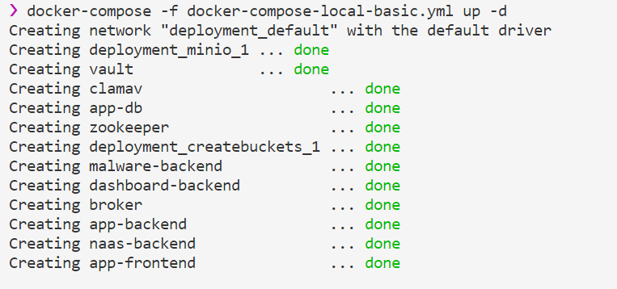
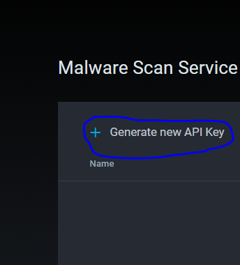

## **Installing with Docker Compose**

Docker Compose helps start the application locally on your computer and supports the development and debugging of the docker containers on your local machine.

*Note: Except for the JWT, which is generated rather than installed, if you do not already have the following software prerequisites installed on your computer, please click their associated links for instructions on how to install them on your specific machine.*

Software Prerequisites:

* [Docker 20.10.13+](https://docs.docker.com/get-docker/))
* [Docker Compose v2.3.3+](https://docs.docker.com/compose/install/)
* [Git 2.35.1+](https://www.git-scm.com/)
* JSON Web Token (JWT)

Hardware Prerequisites :

* 6GB of free RAM is recommended
  
#### **Note**
  
  * *For Windows users*:
    * You must enable the Windows Subsystem for Linux (WSL) engine in Docker Desktop; please consult our [FAQ](./FAQ.md) for the steps to enable the WSL engine.
  * *For all users*:
    * Make sure your firewall settings are not restricting the npm and gradle packages of the docker files.

#### **JSON Web Token (JWT)**

The JWT is used for the internal communication between microservices. You can generate this token by clicking on the link below. Next, copy the generated JWT and update the value in the `jwtKey` and `jwtSecretKey` parameters found in the [docker-compose-local-basic.yml](../deployment/docker-compose-local-basic.yml) file.

* [JWT GENERATOR](https://www.javainuse.com/jwtgenerator)

#### **Git Cloning** 

Clone the Git Repo on your local computer.

*Note*: This can be done by executing the following command via a command prompt, terminal, or a visual git client such as [GitHub Desktop](https://desktop.github.com/).
```
git clone https://github.com/mercedes-benz/DnA.git
```
Once cloning has finished, you will then have a copy of the entire repository on your local machine. Next, go to the deployment folder by executing the the following command: 

*Note*: You must replace <`<Cloned Folder>`> with the actual location path of your computer.
```
cd <<Clonned Folder Path>>/deployment/
```
#### **Docker Compose**
Execute the following Docker Compose command to create the DnA application.
```
docker-compose -f docker-compose-local-basic.yml up -d
```
For Reference:



In your web browser, open the following website: http://localhost:8080. If you have made any changes in the source files, then you must add `--build --force-recreate` args to the Docker Compose command. If you face any issues with Docker Compose, please refer to our [FAQ](./FAQ.md).

To stop the application, use the following command:
```
docker-compose -f docker-compose-local-basic.yml down
```
-------------------------------------------------------------------------------------------------------
## **Installing with Helm**

Helm helps you deploy and manage Kubernetes applications in an easier way.

*Note 1: Except for the JWT, which is generated rather than installed, if you do not already have the following software prerequisites installed on your computer, please click their associated links for instructions on how to install them on your specific machine.*

*Note 2: If you do not currently have Kubernetes installed on your computer, it is best to first consult the [Kubernetes setup page](https://kubernetes.io/docs/setup/) before installing any Kubernetes tools such as Kubectl because you must first choose what type of Kubernetes installation you want, and then you can choose to install tools such as Kubectl.*

Software Prerequisites:

* [Docker Image Registry](https://hub.docker.com/_/registry)
* [Helm v3.8.1+](https://helm.sh/docs/intro/install/)
* JSON Web Token (JWT)
* [Kafka](https://github.com/apache/kafka) 
* [Kubectl 1.22+](https://kubernetes.io/docs/tasks/tools/)
* [Kubernetes Cluster 1.22+](https://kubernetes.io/docs/setup/)
* [Minio Username/Password](https://min.io/)

#### **JSON Web Token (JWT)**

The JWT is used for the internal communication between microservices. You can generate this token by clicking on the link below. Next, copy the generated JWT and update the value within the `jwtKey` and `jwtSecretKey` parameters found in the [values.yaml](../kubernetes/helm/values.yaml) file.

* [JWT GENERATOR](https://www.javainuse.com/jwtgenerator)

#### **Minio Username And Password**

Go to the [minio sub-chart values.yaml](../deployment/kubernetes/helm/charts/minio/values.yaml) and specify your chosen username and password. Then, in the the parent [values.yaml](../kubernetes/helm/values.yaml) file, update the values in the following parameters:

* `minioAccessKey`
* `minioSecretKey`
* `s3AccessKey`
* `s3SecretKey`

*Note: Your chosen password must be at least eight or more characters in length and include a combination of letters, numbers, and symbols.*

#### **Git Cloning** 

Clone the Git Repo on your local computer.

*Note*: This can be done by executing the following command via a command prompt, terminal, or a visual git client such as [GitHub Desktop](https://desktop.github.com/).

```
git clone https://github.com/mercedes-benz/DnA.git
```
Once cloning has finished, you will then have a copy of the entire repository on your local machine. Next, go to the deployment folder by executing the the following command: 

*Note*: You must replace <`<Cloned Folder>`> with the actual location path of your computer.
```
cd <<Clonned Folder Path>>/deployment/
```
#### **Building and Pushing Images**

The following images will be created when executing the command below them:

* Bitnami-postgress
* Broker
* Clamav
* Dashboard
* DnA-backend
* DnA-frontend
* Malware
* Minio
* NaaS-backend
* Storage-be
* Storage-mfe
* Vault
* ZooKeeper

```
cd <<Clonned Folder Path>>/deployment/
docker-compose -f docker-compose-local-basic.yml build
```
*For details on this basic deployment, please refer to this file:* [docker-compose-local-basic.yml](../deployment/docker-compose-local-basic.yml)

Next, execute the following commands to push the images to your repository. 

*Note: You must replace the contents that are enclosed within these brackets <<...>> to their respective values.*
```
docker tag <<image_name_that_were_built_with_docker_compose>> <<your_repository_name/image_name_of_your_wish>>
docker push <<your_repository_name/image_name_of_your_wish>>
```
#### **Namespaces**

Execute the following commands to create namespaces.
```
kubectl create ns dna
kubectl create ns clamav
kubectl create ns naas
kubectl create ns dashboard
kubectl create ns vault
kubectl create ns storage
```
#### **values.yaml**

Update the image names of the respective services in the values.yaml.

  * Please refer to the [values.yaml](../kubernetes/helm/values.yaml) file.

<ins>Example</ins>: To update the image name of frontend-service, please refer to the screenshot below. As in the screenshot below, update the image names for every service in the [values.yaml](../kubernetes/helm/values.yaml) file.


To pull images from the registry, update the .dockerconfigjson value in the [values.yaml](../kubernetes/helm/values.yaml) file.

For more information on the Kubernetes Secret for pulling images, please refer to the [harbor-pull-secret manifest file](../deployment/kubernetes/helm/charts/backend/templates/secrets/harbor-pull-secret.yaml).


#### **Helm Services**

We are offering mutiple services via this Helm Chart, of which you can learn more about by consulting our [Readme.md](../README.md).

In order to use our Helm charts, you must have Kafka installed on your local machine, which you can install by consulting the [Kafka GitHub repository](https://github.com/apache/kafka).

After installing kafka, you must then update the `naasBroker` parameter value in the [Values.yaml](../deployment/kubernetes/helm/values.yaml) file to the fully qualified domain name of the kafka service.

Execute the following commands to deploy the application on a Kubernetes cluster using Helm.
```
cd <<Clonned Folder Path>>\deployment\kubernetes\helm
helm install dna . -f ./charts/values.yaml
```
Execute the following command to list out the Helm releases.
```
helm list
```
**Vault Service**

We are providing vault service to store the API keys that were generated in the malware scan service.

After installing the application with Helm, vault service will throw an error that `Readiness probe error in vault – Seal Type shamir Initialized true Sealed`.

To resolve this error, intialize the vault service and unseal the root key by executing the following command:
```
kubectl exec vault-0 -n vault  -- vault operator init
```
After executing the above command, it will give us the root token and five keys. Save the root token and mention it in the storagebe and backend sections of the [values.yaml](../deployment/kubernetes/helm/values.yaml).

We can unseal the vault service with any of the `3 keys out of 5`.
```
kubectl exec vault-0 -n vault  -- vault operator unseal <key_01>
kubectl exec vault-0 -n vault  -- vault operator unseal <key_02>
kubectl exec vault-0 -n vault  -- vault operator unseal <key_03>
```
For reference:


Execute the following commands to enable the kv engine for storing the secrets:
```
kubectl exec vault-0 -n vault  -- vault operator login <<Vault_root_token>>
kubectl exec vault-0 -n vault  -- vault secrets enable -version=2 -path=kv kv
```
**Attachment Scan**

You can verify that the attachments are free from malicious code by scanning them with the malware scan service. We are creating the malware scan as a service by abstracting the [clamav service](https://github.com/Cisco-Talos/clamav).

To use this service, set the respective values to the following parameters in the [values.yaml](../deployment/kubernetes/helm/values.yaml) file.

In your web browser, open the website, http://localhost:7179, and go to `myservices -> malwarescan` and then click `Generate new API Key` and copy the application key and application id.
```
avscanApiKey:   
avscanAppId: 
```
For reference:




**Upgrading**

If you made changes within any Helm files, you must upgrade Helm via the following command:
```
helm upgrade dna . -f ./charts/values.yaml
```

**Accessing the Application with Localhost**

Port-forward the dna-frontend and storage-mfe service to any port of your choice.

<ins>Example:</ins>
```
kubectl port-forward service/storage-mfe 7175:80
kubectl port-forward service/dna-frontend-service 7179:3000
```
After executing the above commands, you can access the application by opening the http://localhost:7179 port address in your web browser.

**Production Environemnt**

We are already providing ingress manifest files for every microservice. Thus, you can install any kubernetes ingress controller in order to install the application directly in the production environment.

By default, we are disabling the ingress in the [values.yaml](../deployment/kubernetes/helm/values.yaml) file. If you are using ingress in the production environment, then set the parameter to `enabled: true` in the ingress section.

<ins>Example</ins>: Please refer to the image below and enable the ingress for every microservice.


**Note**

*If you are not using the 7175 and 7179 ports, then change the following parameter values in the [values.yaml](../deployment/kubernetes/helm/values.yaml) file*. 
```
storageMFEAppURL:
PROJECTSMO_CONTAINER_APP_URL:
```

**Uninstalling**

To uninstall the Helm app, execute the following command:

```
helm uninstall dna
```
-------------------------------------------------------------------------------------------------------
The DnA Platform can be configured extensively, so please have a look at some possible configuration parameters via the following link:

* [Environment Variables](./APP-ENV-CONFIG.md)

For information on the DnA Authentication process and how to use the simple and free Open ID Connect service via the Okta provider, please consult the following link:

* [OpenId Connect with OKTA](./OPENID-CONNECT.md)
##### FAQ

* [About Git](https://git-scm.com/doc)
* [Docker installation.](https://docs.docker.com/get-docker/)
* [About docker-compose.](https://docs.docker.com/compose/)
* [Helm installation](https://helm.sh/docs/intro/install/)
* [About Helm](https://helm.sh/docs/)

**Troubleshooting**

* *If you face any issues with the Helm installation, please refer to our [FAQ](./FAQ.md)*.
